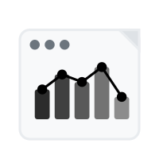

<div align="center">
  
  <h1>Notion Chart Generator</h1>
  <div>
    
    
    
    
    
  </div>
</div>

<br />
一個採用現代前後端分離架構的 Web 應用程式，使用 NestJS + Next.js 技術棧，能夠連接 Notion 資料庫並將資料轉換為美觀的互動式圖表。支援多種圖表類型、資料聚合計算、即時分享和跨平台嵌入功能。

## 主要功能

### 核心功能

- **Notion API 整合**: 直接連接到您的 Notion 資料庫
- **多種圖表類型**: 長條圖、線圖、圓餅圖、雷達圖
- **資料聚合**: 支援 SUM、AVG、MIN、MAX、COUNT 等聚合計算
- **響應式設計**: 完美適配桌面、平板和手機
- **即時互動**: 懸停、縮放、探索您的資料

### 進階功能

- **分享功能**: 生成分享連結，支援跨平台存取
- **iframe 嵌入**: 輕鬆嵌入到其他應用程式
- **快照系統**: 後端快照儲存，確保分享連結永久有效
- **持久化儲存**: Kubernetes 持久化卷支援，資料永不丟失
- **表格檢視**: 完整的資料表格檢視，支援橫向滾動和固定側邊欄
- **自訂 UI 組件**: 使用 Radix UI 打造的現代化使用者介面
- **動態選擇**: 自動載入資料庫列表和屬性選擇
- **美觀介面**: 現代化 UI 設計，優秀的用戶體驗

## 快速開始

### 系統需求

- **Node.js**: 18.0.0 或更高版本
- **npm**: 9.0.0 或更高版本
- **瀏覽器**: Chrome 90+、Firefox 88+、Safari 14+、Edge 90+

### 1. 克隆專案

```bash
git clone https://github.com/SteveLin100132/notion-chart-generator.git
cd notion-chart-generator
```

### 2. 安裝依賴

#### 手動安裝

```bash
# 安裝所有依賴 (前端 + 後端)
npm run install:all
```

### 3. 啟動開發服務器

```bash
# 同時啟動前端和後端
npm run dev

# 或分別啟動
npm run dev:frontend  # 前端: http://localhost:3000
npm run dev:backend   # 後端: http://localhost:3001
```

### 4. 開啟應用程式

開啟瀏覽器至 `http://localhost:3000`

## 部署指南

### Docker 部署

專案已包含完整的 Dockerfile 和 docker-compose 配置：

```bash
# 建構 Docker 映像
docker build -t notion-chart-generator .

# 使用 docker-compose 啟動
docker-compose up -d
```

### 環境變數設定

**前端 (.env.local)**:

```env
NEXT_PUBLIC_API_URL=http://localhost:3001
```

**後端 (.env)**:

```env
PORT=3001
NODE_ENV=production
SNAPSHOT_RETENTION_DAYS=7
CORS_ORIGIN=http://localhost:3000
```

## 圖表類型詳解

| 圖表類型   | 適用場景             | X 軸需求  | Y 軸需求 | 聚合功能      |
| ---------- | -------------------- | --------- | -------- | ------------- |
| **長條圖** | 類別比較、數量統計   | 文字/分類 | 數字     | ✅ 全支援     |
| **線圖**   | 趨勢分析、時間序列   | 文字/日期 | 數字     | ✅ 全支援     |
| **圓餅圖** | 比例分析、百分比     | 標籤      | 數字     | ✅ 計數統計   |
| **雷達圖** | 多維度分析、性能評估 | 標籤      | 數字     | ✅ 多指標顯示 |

### 聚合函數說明

- **SUM (加總)**: 將相同 X 軸 值的所有 Y 軸 數值相加
- **AVG (平均值)**: 計算相同 X 軸 值的 Y 軸 數值平均
- **MIN (最小值)**: 找出相同 X 軸 值中的最小 Y 軸 數值
- **MAX (最大值)**: 找出相同 X 軸 值中的最大 Y 軸 數值
- **COUNT (計數)**: 計算相同 X 軸 值出現的次數

### 支援的 Notion 屬性類型

| Notion 屬性      | 支援程度    | 用途     | 範例               |
| ---------------- | ----------- | -------- | ------------------ |
| **Title**        | ✅ 完全支援 | X 軸標籤 | "產品名稱"         |
| **Rich Text**    | ✅ 完全支援 | 標籤     | "描述文字"         |
| **Number**       | ✅ 完全支援 | Y 軸數值 | 100                |
| **Select**       | ✅ 完全支援 | 分類     | "類別 A"           |
| **Multi-select** | ✅ 完全支援 | 標籤     | "標籤 1, 標籤 2"   |
| **Date**         | ✅ 完全支援 | 時間軸   | "2025-07-29"       |
| **Checkbox**     | ✅ 完全支援 | 二元狀態 | true/false         |
| **URL**          | ✅ 完全支援 | 連結     | "https://..."      |
| **Email**        | ✅ 完全支援 | 聯絡方式 | "user@example.com" |
| **Phone**        | ✅ 完全支援 | 聯絡方式 | "+886-123-456-789" |
| **Formula**      | ⚠️ 部分支援 | 計算結果 | 依公式而定         |
| **Rollup**       | ⚠️ 部分支援 | 聚合值   | 依設定而定         |

## Notion 設定

### 建立 Notion 整合

1. 前往 [Notion Integrations](https://www.notion.so/my-integrations)
2. 點擊 "New integration"
3. 為整合命名並選擇您的工作區
4. 複製 "Internal Integration Token"（以 `secret_` 或 `ntn_` 開頭）

### 分享資料庫

1. 開啟您的 Notion 資料庫
2. 點擊右上角的 "Share"
3. 搜尋您的整合名稱並邀請它
4. 確保整合具有讀取權限

### 常見問題

#### ❌ Token 無效

- 確認 Token 以 `secret_` 或 `ntn_` 開頭
- 檢查整合是否為 Active 狀態
- 重新生成 Token 並更新

#### ❌ 找不到資料庫

- 確認資料庫已分享給整合
- 檢查整合是否有讀取權限
- 嘗試重新載入資料庫列表

#### ❌ 圖表無法顯示

- 確認選擇的屬性包含有效資料
- 檢查 Y 軸 屬性是否為數字類型
- 確認資料庫中有資料記錄
